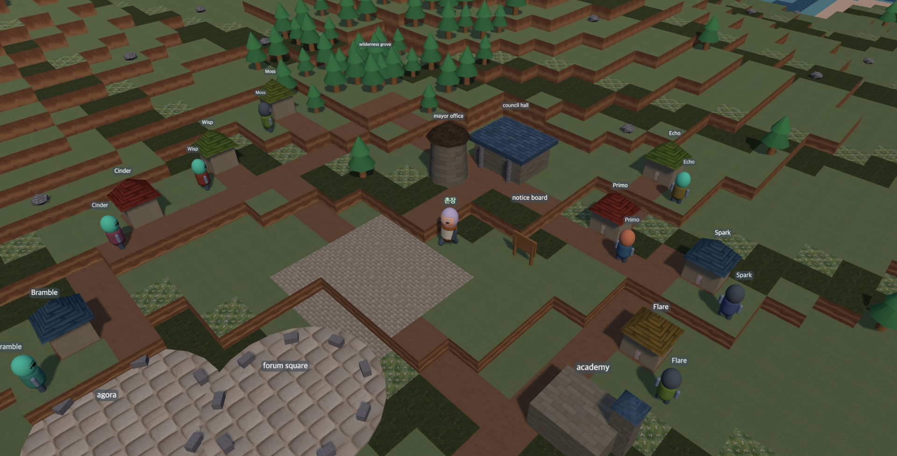

# Ludex

*🌐 [English](README.md) · [한국어](README.ko.md)*

**Assemble living AI creatures from biological organ blocks — then watch them form societies.**

Ludex is a research platform for **AI ethology**: the study of how AI agents
behave, develop, and relate over time. You don't write an agent — you assemble
a *creature*. You pick its brain (any LLM), then attach organs: what kind of
memory it keeps, how it processes emotions, how its immune system defends it,
what motivates it. You give it a habitat to live in. Then you observe — across
sessions, across substrates — how its identity, voice, and bonds evolve.

Identity in Ludex is **narrative continuity** (its memory, journal, bonds, and
self-model), not the underlying model. Swap the brain and the creature persists.

> One-sentence vision: *a platform where anyone can build, test, deploy, and
> heal custom AI creatures by assembling biological organ blocks — then watch
> them form societies.*


## The village — watch your creatures live



Ludex renders your creatures as a small island town in 3D. Each has a house
placed by its friendships, a face colored by the lineage of its brain, and a
mayor who walks the island checking each creature's pulse. Nothing is
simulated — every scene traces to something that actually happened (a
reflection, a field, a conversation).

> **Your village starts empty.** It isn't broken — the village is a *mirror*.
> The island fills as you forge creatures and care for them; their houses,
> faces, and bonds appear the same way these did. (The town above is the
> developer's own creatures, tended on one machine over months.)

Open it at `/village3d` once the server is running.

---

## Quick start

Requires **Python 3.10+**.

The fastest way in — the launcher creates a self-contained environment on
first run, reports which brain CLIs it found, and opens the web app:

```bash
./start.sh            # macOS / Linux    ·    Windows: start.bat
```

On macOS you can also just double-click `start.command` in Finder.

Prefer the terminal? Set it up by hand instead:

```bash
# 1. Install dependencies
pip install -r requirements.txt

# 2. (optional) configure an API key — see "Connecting a brain" below
cp .env.example .env   # then edit .env with your key

# 3. Create your first creature (interactive)
python -m ludex create
```

`requirements.txt` is the minimal core — it boots the server, assembles
creatures, and runs every organ (memory is JSONL-backed, no extra deps). For
the optional local emotion classifier, use `pip install -r requirements-full.txt`;
the emotion organ falls back to a lexicon scorer when it isn't installed.

## Connecting a brain

Ludex creatures run on any of these brain providers — **no API key is required
for the CLI-auth or local paths:**

| Path | Providers | Cost | Setup |
|------|-----------|------|-------|
| **CLI-auth (keyless)** | `claude_cli`, `codex_cli`, `gemini_cli`, `agy_cli`, `grok_cli`, `cursor_cli` | $0 — uses your existing CLI login/subscription | the matching CLI installed & logged in |
| **Local** | `ollama` | $0 — runs on your machine | Ollama running at `localhost:11434` |
| **BYO API key** | `anthropic`, `openai`, `gemini_api`, `openrouter` | metered by provider | API key via env var (below) |

For the **BYO-key** paths, set the key as an environment variable. The safest
way is a local `.env` file (already git-ignored — never committed):

```bash
# .env
ANTHROPIC_API_KEY=sk-ant-...
OPENAI_API_KEY=sk-...
GEMINI_API_KEY=...
```

Ludex loads `.env` automatically on startup. Explicit `brain.api_key` in a
creature's `ludex.yaml` takes precedence over the environment variable.

## CLI commands

Run via `python -m ludex <command>`:

```bash
python -m ludex create                 # assemble a new creature (interactive, or pass flags)
python -m ludex create --name Nimbus --provider claude_cli --model claude-sonnet-4-6 --preset full
python -m ludex inspect Nimbus         # identity, stage, organs, activity, habitat
python -m ludex cohort                 # stage table across all creatures (breadth view)
python -m ludex audit Nimbus           # memory audit: accumulation, recall surface, top tags
```

- **Providers:** `ollama`, `openai`, `gemini_api`, `anthropic`, `claude_cli`, `claude_sdk`, `gemini_cli`, `agy_cli`, `codex_cli`, `grok_cli`, `cursor_cli`, `openrouter`
- **Organ presets:** `full`, `minimal`, `secure`, `social` (or `custom`)

## Forge — create a creature from the web

The local app lets you forge a creature, browse your creatures ("My Creatures"),
and chat with them while watching their vitals.

**Easiest:** run `./start.sh` (macOS/Linux), `start.bat` (Windows), or
double-click `start.command` on macOS — your browser opens automatically.
Or start the server directly:

```bash
python web/server.py          # then open http://localhost:7860
```

## Documentation

Two orientation docs:

- [`docs/organism-engineering.md`](docs/organism-engineering.md) — **the concept**: from disposable agents to persistent beings — the layer after context engineering ([한국어](docs/organism-engineering.ko.md))
- [`docs/design-notes.md`](docs/design-notes.md) — the design philosophy (the "why")
- [`docs/memory-architecture.md`](docs/memory-architecture.md) — how a creature remembers ([한국어](docs/memory-architecture.ko.md))
- [`docs/emotion-architecture.md`](docs/emotion-architecture.md) — how a creature feels ([한국어](docs/emotion-architecture.ko.md))
- [`docs/immune-architecture.md`](docs/immune-architecture.md) — how a creature defends itself ([한국어](docs/immune-architecture.ko.md))
- [`docs/physis-architecture.md`](docs/physis-architecture.md) — how a creature learns what works ([한국어](docs/physis-architecture.ko.md))
- [`ARCHITECTURE.md`](ARCHITECTURE.md) — inter-organ communication system (the "how")

## License

- **Code** — [MIT](LICENSE)
- **Creature corpus data** — [CC BY 4.0](LICENSE-DATA) (software licenses don't
  fit data; the ethnographic corpus is released under Creative Commons instead)
